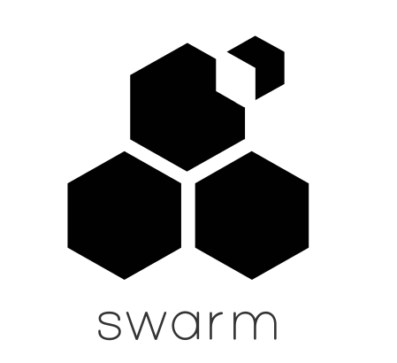
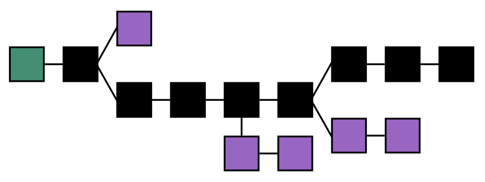

# The future of Ethereum 

By Ethereum Foundation [CC BY 3.0 (http://creativecommons.org/licenses/by/3.0)], via Wikimedia Commons

# Outcomes
In this chapter you will:
- learn about the Ethereum Improvement Proposal (EIP) process
- explore Ethereum’s attempts at implementing a hybrid Proof of Work (PoW) / Proof of Stake (PoS) consensus
algorithm called Casper the Friendly Finality Gadget (FFG)
- gain a basic understanding of the economic model beneath Ethereum’s Casper FFG
consensus algorithm idea
- learn about second layer solutions (like Plasma) which aim to resolve Ethereum’s scalability by taking
transactions off-chain
- learn about Ethereum’s lofty goals of base layer protocol solutions which could resolve the
scalability issues on-chain; through the use of sharding
- learn about completeness, zero knowledge proof and soundness
- learn about ZK-STARKs a long-term and hard-to-implement quantum resistant
improvement for solving blockchain privacy, scalability and speed
- learn about off-chain data solutions (like TheGraph) which enable DApps to easily traverse blockchain data
- learn about new wave of DApps being written in Ethereum's newest smart contract language, Vyper

Before we begin, lets take a look at how ongoing improvements in Ethereum are proposed and implemented in a collaborative and open source environment

# Ethereum Improvement Proposals (EIPs)
Potential improvements to the Ethereum network go through the EIP process before being implemented. The stages for EIPs are draft, accepted, final and differed. Finalised EIPs are proposals which have been adopted. In order for a proposal to succeed the issuer is required to
provide detailed information including the motivation, specifications, rationale and backwards-compatibility. The proposal may also provide code examples.

One interesting EIP is the recent Non-fungible Token (NFT) Standard. This EIP requests the implementation of a standard API for non-fungible tokens (NFTs). Whilst the reference for this EIP implementation is still forthcoming, this is a good example of an EIP which could have a big impact in the Ethereum community as well as the exchange of externally valued assets in the physical world. There are many instances where Ethereum smart contracts may depend on non-fungible tokens. Examples of existing and planned NFTs include LAND, Decentraland and CryptoPunks. Other implementations of NFTs include the world’s first international real-estate marketplace Propy which enables the purchasing of property across international borders.

# A world computer
The creator of Ethereum, Vitalik Buterin defines a blockchain as a decentralised system which contains shared memory, and as such, a good blockchain application, is one that needs both a decentralised architecture as well as shared memory capabilities across the networks architecture. Ethereum's focus, to date, has been on decentralisation. Philosophically, decentralising the internet. The internet, while possessing the design characteristics to be decentralised, has since its inception, become increasingly centralised. The Ethereum network provides guaranteed decentralised computation on a global scale. In addition to this, the Ethereum network holds a shared memory within the entire network; known as the "state".

These attributes, in a technical sense, make Ethereum a "world computer". One which has already proven that it can support next generation decentralised applications (dapps) which facilitate customised online payments, authentication mechanisms, decentralised storage solutions (swarm), digital currencies and much more.

By Ethereum Foundation [CC BY 3.0 (http://creativecommons.org/licenses/by/3.0)], via Wikimedia Commons

In this chapter we will begin by covering the 2018 development of Ethereum. We will look at how
the Ethereum foundation's researchers and Ethereum developers are solving present day challenges.
We will then step into the future by uncovering developments which are at the fringe. Before concluding the
future of Ethereum we will look well into the future, at the "hard to implement" paradigm shifts
which if realised could propel Ethereum forward, beyond what is even imaginable today in terms of
privacy, scalability and security.

# Ethereum 1.0
There are 3 main categories of challenges on the table for Ethereum in 2018. These are privacy, consensus and scalability. The Ethereum Foundation's researchers and Ethereum developers have already made inroads into solving these problematic areas. As you will read shortly, Ethereum have already released their hybrid Proof of Work (PoW) Proof of Stake (PoS) consensus mechanism known as Casper the Friendly Finality Gadget (FFG). The future Ethereum road map is very exciting and full of activity. To kick things of, let's take a look at the problems and solutions around privacy, consensus and scalability in a bit more depth.

## Privacy
The privacy paradox is such that while lots of nodes are verifying your data on the public ledger (providing security through collaborative consensus), having your data on the public ledger, in fact, compromises your privacy. Here is an example. If somebody knew the date, time and amount particulars of a transaction which you sent or received, they could inspect the public ledger and identify your account's address (public key). This issue is common to most public distributed ledgers (blockchains), not just Ethereum. What is important is, from that moment, that person could track your account balance, income and spending via the public ledger. This is an invasion of your privacy. Inroads have been made into resolving the privacy problem, at the base protocol level. The Byzantium had fork released by Ethereum on the 16th of October 2017 introduced new cryptographic algorithms (zero knowledge proofs and ring signatures). These cryptographic tools and other enhancements to the Ethereum network such as the introduction of state channels are all going to help developers resolve these and other privacy problems.

## Consensus

### Proof of Work (PoW)
The consensus process serves as the backbone of all cryptocurrency blockchain networks. Today’s most popular blockchain consensus protocol, called PoW, is described in the original bitcoin white paper. The white paper, written by pseudonym Satoshi Nakamoto, proposes a process of time-stamping transactions by hashing them into an ongoing chain of hash-based proof-of-work.

The advent of the PoW protocol introduced one of the most revered blockchain attributes “immutability”. More specifically, the fact that it is computationally impractical to reverse past transactions whilst computers (nodes on the peer-to-peer blockchain network) are competing to
expend their computational energy, creating new blocks (mining the blockchain). Ethereum currently also uses the PoW consensus protocol and just like with bitcoin, the PoW consensus process on the Ethereum network thrives as computers all compete on the network, expending their
computational energy, to create new blocks on top of the blockchain.

Ethereum was originally designed for central processing unit (CPU) and graphics processing unit (GPU) PoW mining. Interestingly, CPU mining was immediately too inefficient to hold any value. Competitive PoW mining has also continued on other blockchain implementations such as bitcoin. This competition amongst miners has resulted in the creation of more competitive specialised hardware such as application-specific integrated circuit chips (ASICs).

Image by Youwei-han (Own work) [CC BY-SA 4.0 (https://creativecommons.org/licenses/by-
sa/4.0)], via Wikimedia Commons

Whilst PoW has many strengths, it is also criticised in relation to energy efficiency and potential centralisation of the PoW mining process.

### Proof of Stake (PoS)
In October of 2017 Ethereum's Vitalik Buterin and colleague Virgil Griffith released a publication called Casper the Friendly Finality Gadget (FFG). Casper FFG is a partial consensus mechanism which combines PoS algorithm research and Byzantine fault tolerant consensus theory. Importantly for implementation, Casper FFG is designed to overlay an existing operational PoW blockchain. Hence, Casper FFG is a hybrid PoW/PoS consensus solution.

There are more than 3 Ethereum testnets. These Ethereum testnets are sandboxes, used to simulate the Ethereum network and the Ethereum Virtual Machine (EVM). Ethereum's hybrid PoW/PoS implementation, Casper FFG, was launched on its own testnet (not in production) in January of 2018. The following section is an overview of the ideas behind the proposed PoW/PoS hybrid consensus solution; Casper FFG PoW/PoS.

In PoW mining, a miner is set a challenge; finding a nonce. Finding the nonce is done by brute force and involves randomly guessing repeatedly until the nonce is discovered. This process is the miners proof that they have **worked**. Hence the name Proof of Work (PoW). In PoS the blocks are created by validators. Validators are only allowed to participate in creating blocks if they put skin in the game. This involves **staking** a large deposit (for example a significant amount such as 1, 500 ETH). Hence the name Proof of Stake (PoS).

PoS validation is unlike PoW mining from a hardware perspective as there is no specialised competing hardware required. The validators are all virtual (software). The process of joining and leaving the role of being a validator in PoS is known as bonding and unbonding respectively. So how is the bonding and unbonding recorded? Casper FFG saves the bonding and unbonding activity in the blockchain state (along with account balances and so forth). Anyone can join the set of validators by sending a Ethereum transaction to the Casper contract (along with some parameters such as a withdrawal address, and of course ETH for gas).

The basic premise behind PoS validation involves economic incentives. For example, a bonded validator who exerts clearly bad behaviour (like creating two blocks at the same height) will be penalised economically. On the other hand, a bonded validator that does not deliberately attack the network will receive returns, or interest, on the deposit which they have staked. In the Casper FFG PoS implementation, the number of opportunities where manipulation is more profitable than the costs associated with performing the manipulation, are very small. Ideally, there would be close to zero (no) opportunities to manipulate (attack) the network without encountering a severe economic penalty. In a given PoW blockchain implementation (where all nodes are running the same PoW consensus mechanism) the chain with the most blocks (the longest chain) wins. This is because it exhibits the most proof of work.

By original file: Theymos from Bitcoin wiki vectorization: Own work [CC BY 3.0
(http://creativecommons.org/licenses/by/3.0)], via Wikimedia Commons

In Casper FFG PoS, the chain with the most Value at Risk (VaR) supporting it wins. The general principle is that if you support a block that does not make it into the main chain, instead of being rewarded you get penalised. You loose an amount of ETH which is equal to the block reward. In practice let’s propose that there are two blocks available to support. The block on chain A has a 90% chance of succeeding. The block on chain B has a 10% chance of succeeding. If you support chain A you will be rewarded. If you support chain B you will be penalised. A potential economic conundrum comes into play if you start thinking that you could support both A and B for profit. Ethereum came up with a clever way of making this unappealing. In the case where a participant splits their bet two ways, they will only be allowed to receive 50% of the reward from chain A (if it succeeds) and 50% of the reward from chain B (if it succeeds). This betting on both sides will always net a lessor result than just supporting, say, chain A. This economic incentive results in convergence, and this is the
desired path to ensure a single honest chain via PoS consensus. The following is a very simple, albeit concrete, example for demonstration purposes.

Suppose the block reward is 10 ETH. Suppose you, as a validator, support a block on chain A and a block on chain B. In a scenario where chain A succeeds, you would receive 5 ETH (only 50% of the block reward) from your efforts on chain A and you would loose 10 ETH (the entire block reward) for supporting a block on chain B. The net result for this scenario would be negative 5 ETH for your efforts.

In PoS, the validator needs to authenticate. It has been proposed that, instead of simply using a private key, a validator code function be created. This modular design would mean that the validator could choose alternative signatures when authenticating. For example the validator could choose to use a Lamport signature as these are believed to be secure against quantum computer threats.

## Scalability
Blockchain systems trade off against decentralisation, scalability and security. It is reasonably easy to solve any 2 out of these 3 issues at any one time. Vitalik Buterin quips that this is a blockchain trillema, whereby you can easily solve 2 issues at the cost of the third, but you can't easily solve all three.

### Plasma
Plasma is just one of the strategies which could address blockchain scalability. Plasma is different to sharding (which we will cover later in the chapter). A successful plasma implementation would send transactions off-chain to improve scalability. In this regard, plasma is what is known as a second layer solution. Second layer solutions are implemented through code which is written outside of the base layer protocol. More specifically second layer solutions have no effect on the base layer protocol's consensus mechanism. Just to clarify, plasma differs from sharding in that a successful sharding solution would be coded into the base layer protocol. Plasma is designed to be compatible with on-chain scaling solutions such as sharding and therefore can not only co-exist but even be complimentary. In fact on-chain scalability improvements will just further increase the scalability of the second layer solution.

Plasma is a set of nested blockchains. These plasma blockchains are created using smart contracts on the main Ethereum network. Uploading your smart contract onto the public Ethereum blockchain allows you to launch your own specific applications. Applications can include decentralised exchanges, social networks, payment networks and even your own private Ethereum blockchain implementation. These plasma blockchains (your applications) are all accountable to the public Ethereum blockchain.

The scalability is brought about by the fact that whilst processing an extremely high volume of transactions, the plasma blockchains do not submit their entire transaction volume to the public Ethereum blockchain. Instead the plasma blockchains only send a very small amount of data (block header hashes) about the plasma blockchains state. Plasma works on the premise that data being submitted to the main chain is free from fraudulent activity. Whilst the public Ethereum blockchain is not required to perform computation in general. If anyone can publish a proof that fraudulent activity took place (a dispute) the public Ethereum blockchain performs computation, resolving the dispute and punishing the offending participant.

### State Channels
State channels are a mechanism which allow two participants to sign promises, at given points in time. These time based off-chain signed promises provide proof of activity. State channels provide an opportunity for decentralised applications (DApps) to interact with other parties (customers) off-chain. This provides a cheap and fast user experience, which would not be possible on chain. State channels are smart contracts. State channels are also a second layer solution to the Ethereum scalability problem. From a usability perspective (DApp development) having a high volume of off-chain activity means low to negligible gas fees. As such DApps which employ state channels as part of their solution not only offer near real-time activity but also the ability for customers to send and receive micro-payments. A use case for this could be a gambling application which allows a high volume of micro-betting, in real-time, for entertainment purposes.

### Raiden
The Raiden network leverages off-chain state channels. The Raiden network offers micro payments of ERC20 compliant tokens whilst taking negligible fees and providing responses to transactions in near real-time. The difference between state channels and the Raiden network is that rather than creating a new state channel for every new interaction between two parties, Raiden creates a network of channels whereby all participant are transitively connected via a web of ERC20 token complaint, payment channels; making use of natural network topology architecture.

# Ethereum 2.0
Ethereum has plans of creating a blockchain which will far surpass the current second layer solutions on offer. The overall vision is to create a blockchain which will be capable of scaling to thousands of on-chain transactions per second. One of the first public mentions of this vision took place in Taiwan (in December of 2017). During this talk, Vitalik Buterin introduces the notion of parallel blockchains (universes) which could potentially be achieved through the use of an approach known as sharding.

## Sharding
Imagine a system where a protocol can be used to transfer transactions and contracts across 100 different universes. Each of the universes would operate in a different address space and therefore there would be no side-effects in relation to address usage. The universes could communicate using a protocol. The protocol would facilitate the transfer of transactions and contracts between all of the universes. The universes would also share universal overarching consensus. In this scenario, the current (main) Ethereum blockchain would publish what is known as a "Validator Manager Contract". The current Ethereum blockchain would remain in service with the current level of scalability which would be sufficient for this system. The Validator Manager Contract would maintain an internal PoS system; keeping track of, say, 100 universes. The Validator Manager Contract would assign a random validator the right to create the next upcoming block on each of the 100 universes. Validators would include anyone on the current main Ethereum blockchain who wanted to stake ETH into the Validator Manager Contract and become a validator.

Of course each of the 100 universes would produce many transactions and contracts. These could simply be represented and stored on the main chain, via the Validator Manager Contract, as headers only. More specifically Proof of Stake (PoS) block headers. This structure of blocks being represented by headers is not new. It would be in accordance with the current Ethereum PoW block header structure. As we know the block header (which is a small string of characters) is significantly smaller than the entire block of transactions and data. Essentially the Validating Manager Contract acts as a light client for each shard.

We mentioned earlier, that with sharding, there would be no side-effects in relation to address spaces. This design decision brings about an enormous opportunity for developers to perform much needed and important research  and testing in parallel. 

## Zero Knowledge Proofs
The basic premise of the zero knowledge proofs is this. In a given binary situation (where there are only two outcomes available IE. yes/no) a “prover”, with the secret weapon to discern a binary statement from the situation, must convince a sceptical “verifier” that the binary statement is correct, whilst not revealing their secret. In 2003 a Weizmann Institute of Science faculty member, Oded Goldreich, introduced a novel zero knowledge proof scenario involving a colourblind validator. In this scenario the validator possesed two cards, one red and the other green. To the colourblind validator the cards looked the same, other than the fact that the word red was written on the back of the red card, and the word green written on the back of the other. Let's play out this scanario, and assume that the validator is sceptical about the prover's claim to be able to discern the cards without seeing the words on the back. To move this experiment forward the validator would repeatedly show the prover the front side of each card, in a random fashion. Each time, the validator would ask the prover what colour he sees. After some time, the verifier would eventually be convinced that the prover is capable of discerning the colours of the two individual cards. This is mostly due to the fact that a) the verifier performed this over many rounds and b) the validator randomly switched the cards behind his back during each round. Put simply, there is no way that the prover could just guess the correct colour of each randomly presented card over and over again. 

Below are the three properties of which a zero knowledge proof must satisfy:
- Completeness
This is when the honest verifier is convinced that the honest prover returned the correct answer in
their binary statement
- Zero knowledge
Is where the verifier has no knowledge of how the prover came up with their binary statement and
learns nothing from the process other than the fact that the binary statement provided by the prover
is correct
- Soundness
This is where a prover (even a dishonest one who is just guessing the answer of their binary statement) is able to convince an honest verifier that their answer is correct

Whilst the first two properties can be quite easily satisfied during one round of an interactive zero knowledge proof exercise, there is statistically only a 50% chance of achieving soundness. Put simply, a dishonest prover could just take a 50/50 guess to the binary situation, and get it right 50% of the time. 

With this in mind it is important to remember that zero knowledge proof’s are probabilistic. They are not deterministic. They rely on randomness to succeed.

The above information describes a specific type of zero knowledge Protocol known as "interactive". In an interactive zero knowledge protocol the verifyer and the prover must repeat each round until the verifier is convinced, without any reasonable doubt, that the prover knows the secret.

A non-interactive zero knowledge protocol is different because it only requires a single round. A non-interactive zero knowledge proof however requires a "trusted setup". One advantage of the non-interactive zero knowledge protocol is that it allows many verifiers to all independently query the ability of the prover. Think of this as a one:many relationship between the prover and verifier entities, as apposed to the interactive zero knowledge protocol's one:one relationship.

## ZK-SNARKs
These Zero-Knowledge Succinct Non-interactive ARguments of Knowledge (ZK-SNARKs), are able to be satisfied through computer code and as such zero knowledge proof implementations have tremendous potential in the online space. Just one example of ZK-
SNARKs potential is the creation of a decentralised anonymous sealed-bid auction. In this case, whilst the logic of determining the winner would execute successfully, the winner’s identity and the winning bid amount could both remain confidential.

You can think of ZK-SNARKs in the following way. ZK-SNARKs are for arbitary computations, just as hashing algorithm are for arbitary data. Put simply, you can turn an arbitary computation into a ZK-SNARK, and since verifying arbitrary computations is at the core of the Ethereum blockchain, ZK-SNARKs are of course very relevant to Ethereum. If implemented in Ethereum, ZK-SNARKs would not be limited to a single computational problem. Enabling ZK-SNARKs for Ethereum would, amongst other things, reduce the gas costs for certain pairing functions and elliptic curve operations. Overall, the biggest payoff for enabling ZK-SNARKs would be improved (guaranteed) performance of the Ethereum Virtual Machine (EVM). Unfortunately an implementation of this magnitude would be extremely difficult to complete and as such might take many years to move from proof of concept
to early adoption. This may be something which will be implemented in the future of Ethereum. Let's now compare ZK-STARKs. 

## ZK-STARKs
The confidentiality of zero knowledge proof is already being used to enhance privacy in cryptocurrencies. For example Zcash, already uses the ZK-SNARKs protocol. We just mentioned the possibility of an Ethereum implementation of ZK-SNARKs and its associated advantages. However, a new shiner cousin, Zero Knowledge Succinct Transparent ARguments of Knowledge
(ZK-STARKs) looks to resolve one of the primary weaknesses of ZK-SNARKs; its reliance on a “trusted setup”. Interestingly, ZK-STARKs has also arrived with much simpler cryptographic assumptions. You may recall that ZK-SNARKs was promising advantages in relation to pairing functions and elliptical curve operations. Well, ZK-STARKs avoid the need for elliptic curves,
pairings and the knowledge-of-exponent assumption; instead ZK-STARKs rely purely on hashes and information theory. 

This means that whilst ZK-STARKs bring about efficiency gains and more, they are also secure against attackers with quantum computers. Looking towards the future, ZK-STARKs could replace ZK-SNARKs, providing superior scalability and privacy, specifically to decentralised public ledgers like Ethereum. It is also important to note that these advantages all
come at a cost i.e. the size of a proof goes up from 288 bytes to a few hundred kilobytes. Further research is required in relation to shortening proof length or the aggregation and compression of several ZK-STARKs proofs. 

In the context of public blockchain applications there is a) a high need for trust minimisation b) a possibilities that elliptic curves could break and c) a seemingly real possibility of quantum computers coming around. Given all of these points, implementing ZK-STARKs in decentralised public ledgers seems worth it, even if there are costs involved.

## Off-chain data

## Ethereum's newest programming language, Vyper
